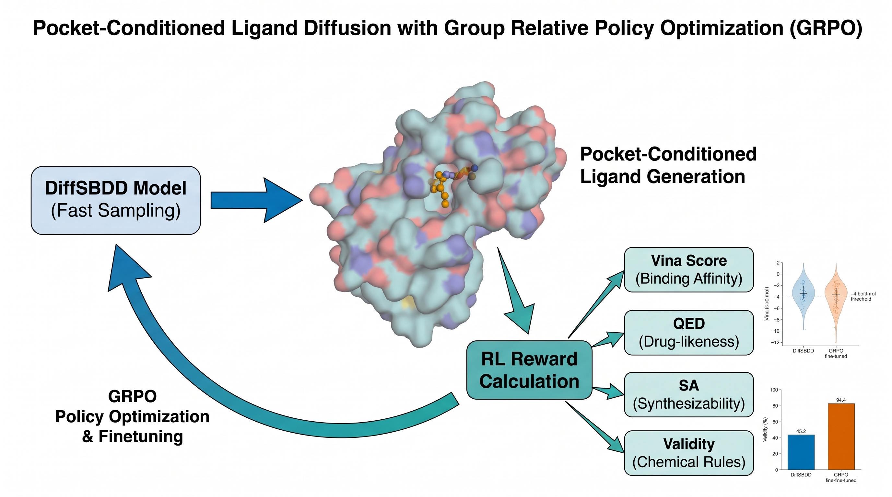
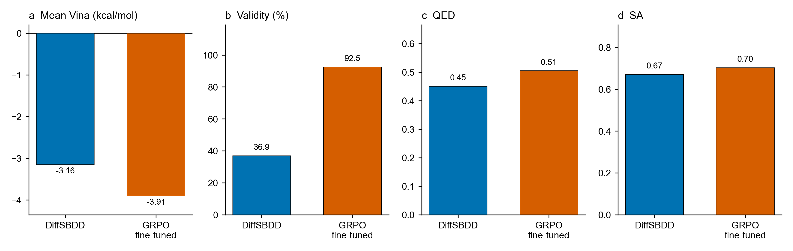
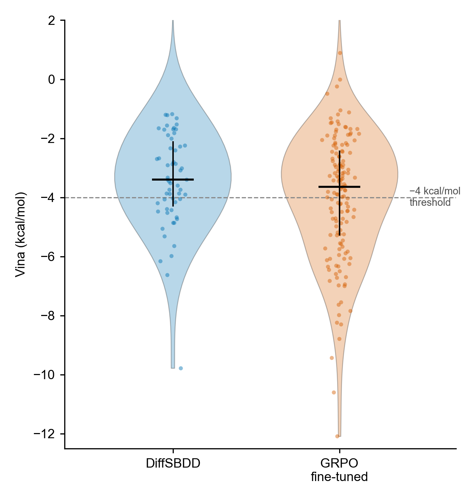

# GRPO-Enhanced Pocket-Conditioned Ligand Diffusion Generation

This repository uses GRPO, a reinforcement-learning method, to fine-tune DiffSBDD for 3D ligand generation in CrossDocked protein pockets; generated molecules are evaluated with QuickVina, QED, synthetic accessibility, and molecular validity.




<ol>
  <li><strong><a href="#1-intro-and-setup">Intro and Setup</a></strong>
    <ol type="i">
      <li><a href="#environment-setup">Environment Setup</a></li>
      <li><a href="#dataset-setup">Dataset Setup</a></li>
      <li><a href="#model-and-checkpoint-setup">Model and Checkpoint Setup</a></li>
    </ol>
  </li>
  <li><strong><a href="#2-fine-tuning">Fine-Tuning</a></strong>
    <ol type="i">
      <li><a href="#running-training">Running Training</a></li>
      <li><a href="#customizing-training">Customizing Training</a></li>
    </ol>
  </li>
  <li><strong><a href="#3-results">Results</a></strong>
    <ol type="i">
      <li><a href="#evaluation-and-metrics">Evaluation and Metrics</a></li>
      <li><a href="#generating-figures">Generating Figures</a></li>
      <li><a href="#reproducing-the-results">Reproducing the Results</a></li>
    </ol>
  </li>
  <li><strong><a href="#4-3d-molecular-viewer">3D Molecular Viewer</a></strong>
    <ol type="i">
      <li><a href="#launching-the-viewer">Launching the Viewer</a></li>
      <li><a href="#viewer-controls">Viewer Controls</a></li>
    </ol>
  </li>
</ol>

## 1. Intro and Setup

### Environment Setup

On Windows, create the Conda environment and install the fine-tuning package:

```powershell
cd model
.\install_env_windows.ps1
conda activate diffsbdd
cd ..
python -m pip install -e .\finetuning --no-deps
```

The setup used for this project was:

| Software | Version |
|---|---:|
| Python | 3.10 |
| PyTorch | 2.4.1 |
| CUDA | 12.4 |
| PyTorch Lightning | 1.8.4 |
| NumPy | 1.26 |

`model/environment_windows.yaml` also installs RDKit, Open Babel, BioPython, SciPy, pandas, and PyTorch Scatter. QuickVina 2 is separate. By default, `run_pilot.ps1` looks for `qvina2.exe` in `%CONDA_PREFIX%\Library\bin\`.

Check the installation:

```powershell
python model\01_setup_check.py
python -m pytest finetuning\tests -q
```

### Dataset Setup

Download CrossDocked using the instructions from [Pocket2Mol](https://github.com/pengxingang/Pocket2Mol/tree/main/data). Put `crossdocked_pocket10/` and `split_by_name.pt` inside the repository's `data/` directory.

Process the dataset without hydrogen atoms:

```powershell
cd model\DiffSBDD
python process_crossdock.py ..\..\data --no_H
cd ..\..
```

This creates `data/processed_crossdock_noH_full_temp/`. Fine-tuning uses this processed directory. The raw structures and split file are only needed if the processed data has to be rebuilt. CrossDocked itself is not included in the repository.

The viewer uses the small structure set in `finetuning/viewer/data/` and runs without CrossDocked.

### Model and Checkpoint Setup

Fine-tuning starts from the pretrained DiffSBDD CrossDocked full-atom conditional model on [Zenodo](https://zenodo.org/record/8183747):

```powershell
python model\03_download_checkpoint.py
```

The script saves the model to `model/checkpoints/crossdocked_fullatom_cond.ckpt`. Model weights are not tracked by Git.

## 2. Fine-Tuning

For each selected pocket, DiffSBDD samples a group of ligands with the same atom count. QuickVina, QED, and synthetic accessibility contribute to the reward. GRPO compares molecules within each group, and the resulting advantages are used to update the diffusion model with the rectified double-head clipped objective. CrossDocked test proteins are kept out of training.

### Running Training

Run the small pilot:

```powershell
conda activate diffsbdd
cd finetuning
.\scripts\run_pilot.ps1
```

The run script calls these four stages:

| Stage | Script | Output |
|---|---|---|
| Pocket selection | `01_select_pockets.py` | `ft_pockets.csv`, `test_pockets.csv` |
| GRPO fine-tuning | `02_train.py` | `last.ckpt`, training log |
| Held-out evaluation | `03_evaluate.py` | molecule and summary JSON files |
| Report | `04_write_report.py` | `eval/STATUS.md` |

Run the Vina-gated configuration:

```powershell
.\scripts\run_pilot.ps1 `
  -Config ..\configs\sufficient_vina.yaml `
  -OutputDir ..\outputs\sufficient_vina
```

Use `-QvinaBinary` or `-ObabelBinary` when either executable is outside the Conda environment.

### Customizing Training

Training settings live in `finetuning/configs/`.

| Section | Parameters |
|---|---|
| `paths` | Base checkpoint, DiffSBDD source, processed data, output directory |
| `pockets` | Data split, fine-tuning pockets, test pockets, clustering |
| `sampler` | Sampler type, denoising steps, group size |
| `train` | Iterations, learning rate, clipping, gradient norm, save interval |
| `reward` | Vina/QED/SA weights, normalization, Vina gate |
| `docking` | Engine, box size, timeout, score-only mode |
| `eval` | Samples per pocket, evaluation timesteps |

| Configuration | Intended use |
|---|---|
| `pilot.yaml` | Three-iteration pipeline check |
| `sufficient.yaml` | Unclipped reward ablation |
| `sufficient_vina.yaml` | Main Vina-gated run |
| `paper.yaml` | Larger experimental setting |

The reported Vina-gated run used 25 fine-tuning pockets, groups of 8, 100 GRPO iterations, and a Vina cutoff of −4.0 kcal/mol.

## 3. Results

### Evaluation and Metrics

The main evaluation used 20 held-out pockets with 8 generated molecules per pocket (160 molecules total).

| Metric | Meaning | DiffSBDD | GRPO |
|---|---|---:|---:|
| Vina | Binding score; lower is better | −3.16 | **−3.91** |
| Validity | RDKit sanitization success | 36.9% | **92.5%** |
| QED | Drug-likeness; higher is better | 0.45 | **0.51** |
| SA | Normalized synthetic accessibility; higher is better | 0.67 | **0.70** |
| Diversity | Pairwise molecular diversity | **0.91** | 0.89 |



*Figure 1. Mean Vina, validity, QED, and synthetic accessibility for DiffSBDD and the GRPO-tuned model.*

The score distribution provides more detail than the mean alone:



*Figure 2. Distribution of QuickVina scores across valid molecules from the held-out pockets.*

The summary is in `finetuning/outputs/sufficient_vina/eval/comparison.json`. Per-molecule scores are stored alongside it.

### Generating Figures

```powershell
conda activate diffsbdd
python finetuning\scripts\plot_figures.py
```

The script writes PNG and PDF files to `figures/`. Its ablation plot uses the saved `sufficient`, `sufficient_dualclip`, and `sufficient_vina` runs.

### Reproducing the Results

The reported run used seed `17`. To rerun it:

```powershell
python model\03_download_checkpoint.py
cd finetuning
.\scripts\run_pilot.ps1 `
  -Config ..\configs\sufficient_vina.yaml `
  -OutputDir ..\outputs\sufficient_vina
cd ..
python finetuning\scripts\plot_figures.py
```

Exact numbers also depend on the processed CrossDocked files, QuickVina build, and DiffSBDD checkpoint. Evaluation summaries are committed, but generated checkpoints are not.

## 4. 3D Molecular Viewer

### Launching the Viewer

Install the viewer command once from the repository root:

```powershell
conda activate diffsbdd
python -m pip install -e .\finetuning --no-deps
ftdiff-viewer
```

The browser opens at `http://127.0.0.1:8765/` (or the next free port). Press `Ctrl+C` in the terminal to stop the server.

It can also be launched from `finetuning/` without installing the command:

```powershell
python src\viewer_server.py
```

Do not open `index.html` directly; the structure files are fetched through the local server.

### Viewer Controls

| Control | Action |
|---|---|
| Pocket | Select a featured CrossDocked pocket |
| Surface / Ribbon | Show the pocket surface or aligned full-protein cartoon |
| DiffSBDD / GRPO | Switch between base and fine-tuned ligands |
| Ligand | Select a generated pose |
| Drag | Rotate the structure |
| Scroll | Zoom |
| Double-click | Focus the selected ligand |

The right panel shows pocket averages and selected-ligand values for Vina, QED, SA, validity, and atom count. The page is a structure viewer, not a molecular-dynamics simulation.
